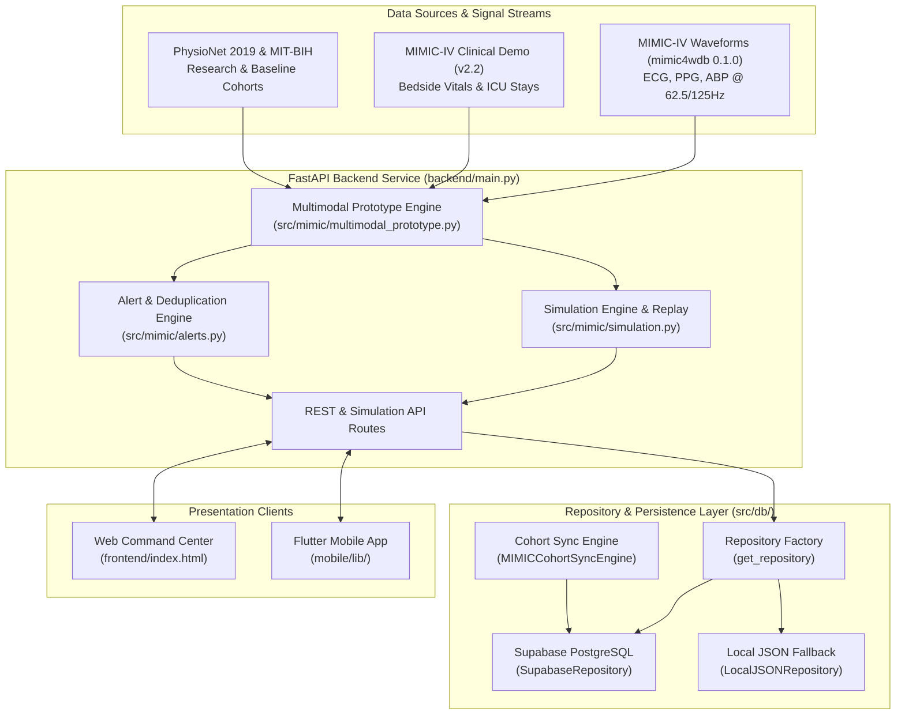

# CareMind: Multimodal ICU Clinical Decision-Support System

[](https://www.python.org/)
[](https://fastapi.tiangolo.com/)
[](https://supabase.com/)
[](https://flutter.dev/)
[](#project-overview)

> [!IMPORTANT]
> **Clinical & Research Disclaimer**: CareMind is an academic research software prototype and an Intensive Care Unit (ICU) clinical decision-support system (CDSS) proof-of-concept. Model outputs, alert scores, and patient prioritization rankings are decision-support insights intended to assist clinical teams in identifying potential physiological deterioration. CareMind is strictly a decision-support prototype and is **NOT** a substitute for professional clinical judgment, medical diagnosis, direct patient evaluation, or primary ICU bedside monitoring equipment. CareMind has not undergone clinical trials or regulatory review (e.g., FDA 510(k)).

---

## 1. Project Overview

**CareMind** is an AI-based multimodal Intensive Care Unit (ICU) clinical decision-support platform designed for real-time continuous vital monitoring, early physiological risk estimation, dynamic patient prioritization, and explainable decision support.

In high-acuity ICU environments, clinical teams are inundated with high-frequency telemetry data streams and fragmented bedside documentation, frequently leading to alarm fatigue and delayed intervention during early physiological decay. CareMind addresses this challenge by fusing:
1. **Continuous Physiological Waveforms**: High-frequency multi-channel telemetry signals including Electrocardiogram (ECG), Photoplethysmogram (PPG), and Arterial Blood Pressure (ABP).
2. **Bedside Clinical Vitals**: Intermittent discrete clinical observations including Heart Rate (HR), Oxygen Saturation ($\text{SpO}_2$), Respiratory Rate (Resp), Systolic/Diastolic Blood Pressure (SysBP/DiaBP), Mean Arterial Pressure (MAP), and Body Temperature.

CareMind computes a continuous **Physiological Risk Score (0–100)**, categorizes instability (`LOW`, `MEDIUM`, `HIGH`), assigns dynamic patient priority status (`CRITICAL_PRIORITY`, `HIGH_PRIORITY`, `ROUTINE_MONITORING`), tracks temporal trend dynamics (`ESCALATING`, `STABLE`, `IMPROVING`), triggers stateful deduplicated alerts, and presents evidence-grounded explainability factors across both Web and Mobile client interfaces.

---

## 2. Key Features

- 🩺 **Multimodal Real-Time Physiological Risk Engine**: Fuses continuous high-frequency waveforms (ECG, PPG, ABP) and bedside clinical vitals into a calibrated composite risk score (0–100).
- 📊 **Dynamic ICU Patient Triage & Auto-Prioritization**: Automatically ranks all monitored ICU beds descending by current physiological risk score, directing clinician focus to the highest-acuity patients first.
- 🚨 **Deduplicated Evidence-Grounded Alert Engine**: Generates stateful alerts (`HIGH_RISK`, `RISK_ESCALATING`, `PHYSIOLOGICAL_ABNORMALITY`, `MODALITY_SIGNAL_CHANGE`) with automatic state deduplication to reduce alarm fatigue.
- 💡 **Physiological Explainability & Risk Attribution**: Provides transparent, factor-by-factor evidence attributions specifying modality, severity, evidence text, and contribution scores for every assessment.
- ⏱️ **Observation Window Replay & Multi-Patient Simulation**: Features a time-series replay engine that advances multi-patient ICU stays across sequential observation windows (Window 0 to Window 3) to test real-time triage dynamics.
- 🛢️ **Dual-Layer Database Persistence**: Integrates Supabase PostgreSQL for cloud operational data storage with an automatic `LocalJSONRepository` fallback for offline demo execution.
- 🖥️ **Modern Web Command Center**: Standalone responsive clinical dashboard (`frontend/index.html`) featuring interactive patient rosters, real-time waveform rendering, alert feeds, and interactive what-if vitals override testing.
- 📱 **Cross-Platform Flutter Mobile Client**: Flutter mobile application (`mobile/`) supporting Android, iOS, and Web with platform-aware FastAPI backend auto-detection.

---

## 3. System Architecture

CareMind operates on a decoupled microservice architecture separating data ingestion, machine learning risk inference, repository persistence, and client presentation layers.



### Data & Layer Flow
1. **Signal Processing & Feature Extraction**: Waveform signals are filtered and windowed by `MIMICWaveformProcessor` and converted into tabular instability metrics by `MIMICWaveformFeatureExtractor`.
2. **Modality Encoding & Adaptive Fusion**: `ModalityEncoder` scales clinical and waveform vectors, applying temperature-calibrated logit scaling ($T=1.75$) to compute modality scores before adaptive model fusion.
3. **Alert & Prioritization Evaluation**: `AlertEngine` evaluates window analysis against threshold and trend criteria, creating or updating active stateful alerts.
4. **Persistence & Sync**: `CareMindBaseRepository` handles read/write queries to Supabase PostgreSQL or local JSON cache. `MIMICCohortSyncEngine` keeps operational database tables synchronized with the local cohort index.

---

## 4. Technology Stack

| Component | Technology / Library | Version | Purpose |
| :--- | :--- | :--- | :--- |
| **Backend Framework** | Python / FastAPI | Python 3.10+ / FastAPI 0.100+ | Asynchronous REST API, simulation engine, and backend orchestration |
| **Machine Learning** | Scikit-Learn, PyTorch | Scikit-Learn 1.3+, PyTorch 2.0+ | Tabular feature scaling, logistic regression fusion, and 1D CNN raw ECG classifier |
| **Signal Processing** | NumPy, Pandas, WFDB, SciPy | Latest | High-frequency signal processing, Butterworth filtering, and PhysioNet WFDB record I/O |
| **Database & Persistence**| Supabase PostgreSQL, `supabase-py` | Supabase SDK 2.0+ | Cloud operational table storage (Patients, Stays, Vitals, Assessments, Alerts) |
| **Local Fallback** | Local JSON Cache | Native Python `json` | Offline execution fallback when Supabase is unconfigured |
| **Web Dashboard** | HTML5, Vanilla CSS, JavaScript (ES6+) | Modern Browsers | High-performance clinical dashboard with Chart.js vitals charts & Canvas waveform rendering |
| **Mobile Client** | Flutter / Dart | Flutter 3.0+ / Dart 3.0+ | Cross-platform mobile UI for Android, iOS, and Web |
| **Testing Suite** | Pytest | Pytest 7.0+ | Automated unit, repository, pipeline, and model evaluation test suite |

---

## 5. Datasets and Data Sources

CareMind integrates multiple benchmark healthcare datasets for research, model training, baseline evaluation, and real-time demonstration:

| Dataset | Primary Modality | Sample Rate / Resolution | Purpose in CareMind | Data Limitations |
| :--- | :--- | :--- | :--- | :--- |
| **MIMIC-IV Waveform Database (`mimic4wdb/0.1.0`)** | Continuous ECG, PPG, ABP | 62.5 Hz / 125.0 Hz | Real continuous multi-channel waveform extraction for multimodal prototype inference. | Requires WFDB signal processing; variable channel availability across patient stays. |
| **MIMIC-IV Clinical Database Demo (`v2.2`)** | Bedside Vitals, Demographics, ICU Stays | Discrete hourly / stay events | Bedside clinical vitals linkage (HR, $\text{SpO}_2$, Resp, BP, Temp) and patient stay metadata. | Demo subset contains 100 subjects; sparse laboratory observations. |
| **PhysioNet / CinC Challenge 2019** | Hourly Vitals & Clinical Metrics | Hourly time-series | Phase 4/5 baseline temporal sepsis risk prediction and leakage-free ETL pipeline evaluation. | High missingness in laboratory metrics (>85%); synthetic clipping required. |
| **MIT-BIH Arrhythmia Database** | Dual-lead ECG | 360 Hz | Baseline single-lead ECG arrhythmia beat classification (de Chazal DS1/DS2 inter-patient split). | Single-modality ECG beats; limited to 48 records. |

> [!NOTE]
> **Data Storage Architecture Notice**: Raw research dataset files (WFDB waveform binaries, PhysioNet raw CSVs, parquet files) are stored locally in `data/` or cached on server storage. They are **NOT** bulk-stored inside Supabase PostgreSQL. Supabase stores structured operational schemas (patient records, stay IDs, observation window vitals, score histories, and alert records).

---

## 6. AI/ML Models & Multimodal Fusion

CareMind implements both operational prototype models and standalone experimental baseline models:

```text
                                ┌───────────────────────────┐
                                │   Bedside Vitals Vector   │
                                │ [HR, SpO2, Resp, BP, Temp]│
                                └─────────────┬─────────────┘
                                              │
                                              ▼
                                ┌───────────────────────────┐
                                │   Clinical Risk Encoder   │
                                │ StandardScaler + LogReg   │
                                └─────────────┬─────────────┘
                                              │ (Clinical Score 0-100)
                                              ▼
┌───────────────────────────┐   ┌───────────────────────────┐   ┌───────────────────────────┐
│ Real Waveform Signals     │──►│   Waveform Risk Encoder   │──►│ Adaptive Multimodal Fusion│──► Fused Score (0-100)
│ (ECG, PPG, ABP Streams)   │   │ StandardScaler + LogReg   │   │ Temperature Calibration   │    Category (LOW/MED/HIGH)
└───────────────────────────┘   └───────────────────────────┘   └───────────────────────────┘
```

### 1. Production Multimodal Prototype Models (`src/mimic/multimodal_prototype.py`)
- **Clinical Vital Encoder**: `StandardScaler` + `LogisticRegression` ($C=1.0$) trained on bedside clinical vitals vectors (`HR`, `SpO2`, `Resp`, `SysBP`, `DiaBP`, `MAP`, `Temp`). Applies temperature dispersion ($T=1.75$) to prevent score saturation at 100.0.
- **Waveform Instability Encoder**: `StandardScaler` + `LogisticRegression` trained on 13 signal features including ECG standard deviation, RMS, peak-to-peak amplitude, PPG amplitude range, and ABP pulse pressure.
- **Adaptive Fusion Engine**: Dynamically selects fusion strategy based on available modalities:
  - *Both Modalities Present*: Fuses clinical and waveform logit probabilities with temperature calibration:
    $$\text{Raw Score} = 0.5 \cdot S_{\text{clinical}} + 0.5 \cdot S_{\text{waveform}} + (P_{\text{fusion}} - 0.5) \cdot 10.0$$
  - *Single Modality Present*: Gracefully falls back to pure Clinical or pure Waveform scoring without throwing execution errors.

### 2. Experimental Baseline Models
- **1D CNN ECG Raw Signal Classifier** (`src/models/ecg_cnn.py`): 3-layer 1D Convolutional Neural Network with BatchNorm, ReLU, MaxPool1d, and Dropout evaluating raw ECG waveform window classification.
- **MIT-BIH Baseline ECG Classifier**: Morphological 11D feature extraction + `SVC` evaluating 5 AAMI beat classes (`N`, `S`, `V`, `F`, `Q`).
- **PhysioNet 2019 Temporal Sepsis Model** (`src/physionet2019/baseline.py`): `RandomForestClassifier` trained on leakage-free train-imputed vitals, temporal deltas, and rolling window statistics.

### Empirical Research Evaluation Summary

*Evaluated on holdout test set with zero-leakage patient-level GroupShuffleSplit (`experiments/mimic_multimodal/metrics_summary.json`):*

| Model Architecture | Input Modalities | Precision | Recall | F1 Score | ROC-AUC | PR-AUC |
| :--- | :--- | :---: | :---: | :---: | :---: | :---: |
| **Unimodal Baseline (PPG Only)** | PPG Waveform Features | 0.4737 | 0.2308 | 0.3103 | 0.5465 | 0.4680 |
| **Unimodal Baseline (ECG Only)** | ECG Waveform Features | 0.7083 | 0.4359 | 0.5397 | 0.6807 | 0.7226 |
| **Unimodal Baseline (ABP Only)** | ABP Waveform Features | 0.5789 | 0.5641 | 0.5714 | 0.6933 | 0.7177 |
| **Unimodal Baseline (Clinical Vitals)**| Bedside Vitals | 0.7000 | 0.5385 | 0.6087 | 0.7712 | 0.7506 |
| **Waveform Multi-Signal RF** | ECG + PPG + ABP | 0.7812 | 0.6410 | 0.7042 | 0.7989 | 0.8379 |
| **CareMind Multimodal Fusion (Best)** | **Clinical + ECG + PPG + ABP** | **0.8125** | **0.6667** | **0.7324** | **0.8276** | **0.8516** |

> [!NOTE]
> **Score Interpretation**: CareMind risk scores are continuous physiological instability indices (0–100) derived for clinical decision support. They do **NOT** represent statistical mortality probabilities or diagnostic infection predictions.

---

## 7. Risk Assessment & Prioritization

CareMind provides a structured two-level risk interpretation framework:

### 1. Risk Scoring & Classification
- **Continuous Score Scale**: `0.0` (optimal stability) to `100.0` (extreme physiological instability).
- **Risk Category Thresholds**:
  - `LOW`: Score $< 50.0$
  - `MEDIUM`: $50.0 \le \text{Score} < 75.0$
  - `HIGH`: Score $\ge 75.0$

### 2. Temporal Trend & Priority Status
- **Temporal Risk Delta ($\Delta$)**: Difference between current window score and previous window score.
  - `ESCALATING`: $\Delta \ge +5.0$ points
  - `IMPROVING`: $\Delta \le -5.0$ points
  - `STABLE`: $-5.0 < \Delta < +5.0$ points
- **Dynamic Priority Ranking**:
  - `CRITICAL_PRIORITY`: Score $\ge 75.0$, or Score $\ge 60.0$ with `ESCALATING` trend.
  - `HIGH_PRIORITY`: Score $\ge 50.0$, or Score $\ge 40.0$ with `ESCALATING` trend.
  - `ROUTINE_MONITORING`: Default status for stable parameters.

---

## 8. Alerts and Explainability

### Stateful Alert Engine (`src/mimic/alerts.py`)
To prevent notification fatigue, CareMind manages active alert states using patient-level deduplication keys (`{record_id}:{alert_type}`):

| Alert Type | Severity | Trigger Criteria | Action & Lifecycle |
| :--- | :--- | :--- | :--- |
| `HIGH_RISK` | `HIGH` | CareMind risk score $\ge 75.0$ or Category `HIGH`. | Active until risk drops below 75.0; timestamp updates without duplicating alerts. |
| `RISK_ESCALATING` | `HIGH` / `MEDIUM` | Risk trend `ESCALATING` with $\Delta \ge +5.0$ points. | Active during rapid escalation; clears when trend stabilizes. |
| `PHYSIOLOGICAL_ABNORMALITY` | `HIGH` | High-severity physiological factor detected (e.g., severe hypoxia, hypotension). | Grounded in specific vital thresholds; updates active evidence text. |
| `MODALITY_SIGNAL_CHANGE` | `INFO` | Clinical vitals unobserved; operating on continuous waveforms. | Informational notification regarding modality availability changes. |

### Grounded Physiological Explainability
Every assessment produces structured contributing factor attributions grounded strictly in observed parameters:
```json
{
  "factor": "Hypoxia / Reduced SpO2",
  "modality": "Clinical Vitals",
  "severity": "HIGH",
  "impact": "HIGH",
  "evidence": "SpO2 saturation level at 89.0% (normal >= 95%)",
  "contribution_score": 15.0
}
```

---

## 9. Supabase & Persistence Architecture

CareMind features a flexible dual-layer persistence system:

```text
                     ┌───────────────────────────────┐
                     │   get_repository() Factory    │
                     └───────────────┬───────────────┘
                                     │
                    Is Supabase URL & Key configured?
                                ╱         ╲
                             YES           NO
                             ╱               ╲
                            ▼                 ▼
             ┌───────────────────────────┐   ┌───────────────────────────┐
             │   SupabaseRepository      │   │   LocalJSONRepository     │
             │ (PostgreSQL Operational)  │   │  (Offline JSON Cache)     │
             └───────────────────────────┘   └───────────────────────────┘
```

### 1. Operational Database Schema (`supabase/migrations/001_initial_schema.sql`)
The PostgreSQL database consists of 7 structured operational tables:
1. `patients`: Subject demographics (`subject_id`, `gender`, `anchor_age`).
2. `icu_stays`: Care unit stay details (`stay_id`, `bed_id`, `careunit`, `intime`, `outtime`).
3. `waveform_records`: Waveform metadata (`record_id`, sampling rate `fs`, duration, available modalities).
4. `observation_windows`: Sequential timeline windows (`window_index`, `timestamp_label`, `obs_timestamp`).
5. `vital_observations`: Window vital measurements (`hr`, `spo2`, `resp`, `sys_bp`, `dia_bp`, `map_bp`, `temp`).
6. `risk_assessments`: Generated scores (`risk_score`, `risk_category`, `clinical_score`, `waveform_score`).
7. `physiological_alerts`: Stateful alert records (`factor_name`, `impact_level`, `description`, `contribution_score`).

### 2. Cohort Synchronization (`src/db/cohort_sync.py`)
- Provides idempotent synchronization between the local cohort index and Supabase database tables.
- Dynamically manages cohort expansion or shrinking (e.g., synchronizing 24 active operational records).
- Triggered manually via endpoint `POST /api/multimodal/sync_cohort` or CLI seed script `src/db/seed_runner.py`.

### 3. Local JSON Fallback (`src/db/repository.py`)
- If Supabase environment variables (`SUPABASE_URL`, `SUPABASE_KEY`) are missing or unconfigured, CareMind automatically switches to `LocalJSONRepository`.
- Loads pre-analyzed demo waveform timelines directly from `data/demo_waveforms/*.json`, allowing full offline execution without external database dependencies.

---

## 10. Web Command Center Dashboard

The CareMind Web Dashboard (`frontend/index.html`) is a standalone clinical interface served directly by FastAPI at `http://localhost:8000/`.

```text
┌──────────────────────────────────────────────────────────────────────────────────┐
│ CAREMIND — ICU COMMAND CENTER                                  [Live Simulation] │
├───────────────────────────────┬──────────────────────────────────────────────────┤
│ PATIENT ROSTER (Auto-Sorted) │ SELECTED PATIENT DETAIL                          │
│                               │ Patient #10014354 • Bed MICU-01                   │
│ 🔴 Bed 01 | Score: 88.5 (HIGH)│ ──────────────────────────────────────────────── │
│ 🟠 Bed 04 | Score: 68.2 (MED) │ CareMind Risk Score: 88.5 [CRITICAL PRIORITY]    │
│ 🟢 Bed 02 | Score: 24.1 (LOW) │ Clinical Score: 85.0 | Waveform Score: 92.0      │
│                               │                                                  │
├───────────────────────────────┼──────────────────────────────────────────────────┤
│ ACTIVE ALERTS FEED            │ CONTINUOUS WAVEFORM TELEMETRY & VITALS CHARTS    │
│ 🚨 ALT-81739927-HIGH          │ ── ECG Waveform (mV) ──────────────────────────  │
│    High Physiological Risk    │ ── PPG Pulse Wave ──────────────────────────────  │
│ ⚠️ ALT-81739927-ABN          │                                                  │
│    Hypoxia (SpO2 89.0%)       │ CONTRIBUTING FACTORS EXPLAINABILITY              │
│                               │ • Elevated Heart Rate (112 bpm) - Score: +15.0   │
└───────────────────────────────┴──────────────────────────────────────────────────┘
```

### Core Web Dashboard Features
- **ICU Patient Prioritization Roster**: Lists all monitored patients automatically sorted descending by risk score.
- **Detailed Patient Inspector**: Displays current vitals, modality scores, risk category, and priority badges.
- **Interactive Vitals & Waveform Charts**: Renders continuous ECG/PPG waveforms on canvas and plots vital trends with Chart.js.
- **Active Alert Feed**: Displays real-time stateful alerts with severity filtering.
- **Multi-Patient Simulation Controls**: Control buttons to Play, Step, Reset, and view progress across observation windows.
- **What-If Vitals Override Drawer**: Allows clinicians to manually modify vital values and instantly re-run multimodal risk inference.

---

## 11. Cross-Platform Flutter Mobile Application

Located in `mobile/`, the CareMind mobile client provides responsive mobile clinical monitoring for Android, iOS, and Web.

### API Connection Configuration (`mobile/lib/config/api_config.dart`)
The app automatically detects the host platform to set the FastAPI backend base URL:
- **Android Emulator**: `http://10.0.2.2:8000`
- **Flutter Web / Chrome / Desktop**: `http://localhost:8000`
- **Custom IP / Environment Override**: Pass `--dart-define=API_URL=http://<YOUR_LOCAL_IP>:8000` at launch.

```bash
# Run Flutter app on connected device or emulator
cd mobile
flutter pub get
flutter run --dart-define=API_URL=http://10.0.2.2:8000
```

---

## 12. REST & Simulation API Reference

The FastAPI backend (`backend/main.py`) exposes the following endpoints:

| Endpoint | Method | Description |
| :--- | :---: | :--- |
| `/api/health` | `GET` | System status, API version, and health check. |
| `/api/multimodal/records` | `GET` | Returns list of available demo waveform records and modalities. |
| `/api/multimodal/records/{record_id}` | `GET` | Returns details and available channels for a specific record. |
| `/api/multimodal/patients` | `GET` | Returns all ICU patients for a window, **automatically sorted by risk score descending**. |
| `/api/multimodal/analyze` | `POST` | Executes multimodal risk scoring for a patient window (supports vitals override). |
| `/api/multimodal/replay/{record_id}` | `GET` | Returns full sequential observation timeline array for a record. |
| `/api/multimodal/sync_cohort` | `POST` | Triggers idempotent cohort metadata synchronization with Supabase DB. |
| `/api/alerts` | `GET` | Returns all currently active deduplicated alerts across ICU patients. |
| `/api/alerts/{patient_id}` | `GET` | Returns active alerts for a specific patient. |
| `/api/simulation/state` | `GET` | Returns current state snapshot of the multi-patient simulation. |
| `/api/simulation/start` | `POST` | Resumes or starts multi-patient simulation playback. |
| `/api/simulation/step` | `POST` | Advances simulation across all ICU patients by 1 observation step. |
| `/api/research/metrics` | `GET` | Returns empirical model evaluation metrics, baseline comparisons, and scientific disclaimers. |

---

## 13. Installation and Setup

### 1. Prerequisites
- **Python**: Version `3.10` or higher (`3.10`, `3.11`, `3.12`, or `3.13` supported).
- **Git**: For repository access.
- **Flutter SDK** *(Optional)*: Required only if building/running the mobile app.
- **Supabase Account** *(Optional)*: Required only if using cloud PostgreSQL storage.

### 2. Clone Repository & Setup Virtual Environment
```bash
# Clone the repository
git clone https://github.com/sneha-inamdar/CareMind.git
cd CareMind

# Create virtual environment
python -m venv venv

# Activate virtual environment
# On Windows (PowerShell):
.\venv\Scripts\Activate.ps1
# On macOS / Linux:
source venv/bin/activate

# Install Python dependencies
pip install --upgrade pip
pip install -r requirements.txt
```

### 3. Environment Configuration (`.env`)
Create a `.env` file in the project root directory based on `.env.example`:

```env
# Project Environment Configuration
ENV=development

# Supabase Credentials (Optional — CareMind falls back to LocalJSON if unconfigured)
SUPABASE_URL=https://your-project-id.supabase.co
SUPABASE_KEY=your-supabase-anon-key
SUPABASE_SERVICE_ROLE_KEY=your-supabase-service-role-key
```

> [!WARNING]
> **Security Rule**: The `SUPABASE_SERVICE_ROLE_KEY` has administrative bypass privileges. It must remain strictly server-side (loaded by FastAPI in `backend/` or admin CLI scripts) and must **NEVER** be committed to Git or embedded in client code (Web HTML/JS or Flutter mobile apps).

---

## 14. Running CareMind

### 1. Launch FastAPI Backend
From the project root directory:

```bash
# Start backend server using uvicorn
uvicorn backend.main:app --reload --port 8000
```
*The backend API will start at `http://localhost:8000`.*

### 2. Access Web Command Center Dashboard
Open your browser and navigate to:
- **Integrated URL**: `http://localhost:8000/` (served directly by FastAPI static files)
- **Direct File**: Open `frontend/index.html` directly in Google Chrome or Microsoft Edge.

### 3. Launch Mobile Application (Flutter)
```bash
cd mobile

# Install Flutter dependencies
flutter pub get

# Launch on Chrome / Web
flutter run -d chrome

# Launch on Android Emulator
flutter run -d android
```

---

## 15. Testing & Verification

CareMind includes an extensive automated test suite covering database repositories, multimodal risk inference, alert deduplication, simulation replay, cohort sync, and baseline ML models.

### Run Automated Tests
```bash
# Execute unit test suite ignoring heavy raw data directories
python -m pytest tests/ --ignore=data -v
```

### Test Coverage Summary
- `tests/test_database_repository.py`: Verifies repository factory, Supabase connectivity, and `LocalJSONRepository` fallback mechanisms.
- `tests/test_mimic_multimodal_prototype.py`: Tests clinical extraction, waveform feature vectors, temperature scaling, and adaptive fusion logic.
- `tests/test_explainability_alerts_simulation.py`: Tests `AlertEngine` stateful deduplication, contributing factor derivations, and multi-patient simulation step transitions.
- `tests/test_cohort_sync.py`: Verifies idempotent cohort synchronization to Supabase operational tables.
- `tests/test_physionet2019_etl.py` & `test_physionet2019_baseline.py`: Tests PhysioNet 2019 data cleaning, leakage-free splitting, and Random Forest baseline training.
- `tests/test_expanded_cohort_and_cnn.py`: Tests 1D CNN ECG model initialization and multi-patient record scaling.

---

## 16. Current Limitations & Research Status

CareMind is an active academic research prototype. The current implementation includes the following engineering boundaries:
- **Decision-Support Prototype**: Designed strictly to demonstrate multimodal AI fusion and priority ranking in ICU settings. It is not approved for diagnostic or therapeutic use.
- **Operational Cohort Scale**: Operates on a dynamic cohort index (demo operational database setup configured with 24 active patient records). Cohort size scales dynamically based on available waveform files.
- **Signal Quality Sensitivity**: Waveform feature extraction relies on valid signal windows; extreme motion artifacts are handled via zero-filling and missingness indicators.

---

## 17. Repository Structure

```text
CareMind/
├── .env.example                       # Example environment configuration template
├── README.md                          # Master project documentation
├── requirements.txt                    # Python dependencies
├── run_physionet2019_etl.py           # CLI entrypoint for PhysioNet 2019 ETL pipeline
│
├── backend/                           # FastAPI Service
│   └── main.py                        # FastAPI application, REST routes & static server
│
├── src/                               # Core Python Source Code
│   ├── db/                            # Database & Persistence Layer
│   │   ├── config.py                  # Database environment configuration
│   │   ├── repository.py              # Repository pattern (Supabase & LocalJSON fallback)
│   │   ├── cohort_sync.py             # Idempotent cohort sync engine
│   │   └── seed_runner.py             # Database seed & migration runner
│   │
│   ├── mimic/                         # MIMIC Multimodal Processing Subsystem
│   │   ├── multimodal_prototype.py    # Modality encoders & adaptive fusion risk engine
│   │   ├── simulation.py              # Multi-patient real-time simulation engine
│   │   ├── alerts.py                  # Stateful alert engine & deduplication system
│   │   ├── cohort_ingestion.py        # Cohort discovery & feature extraction
│   │   ├── waveform_linker.py         # Waveform record & subject linkage
│   │   ├── waveform_processor.py      # Waveform signal filtering & windowing
│   │   ├── waveform_features.py       # Waveform instability feature extractor
│   │   └── evaluator.py               # Scientific evaluation engine
│   │
│   ├── models/                        # ML Model Definitions
│   │   └── ecg_cnn.py                 # 1D CNN raw ECG classifier PyTorch module
│   │
│   └── physionet2019/                 # PhysioNet 2019 Baseline Pipeline
│       ├── baseline.py                # Temporal sepsis Random Forest model
│       ├── cleaner.py                 # Train-only fitted LOCF + median cleaning
│       ├── downloader.py              # Multi-threaded dataset fetcher
│       ├── splitter.py                # Stratified 70/15/15 patient splitter
│       ├── transformer.py             # Rolling statistics & delta feature engine
│       └── validator.py               # Dataset validation & monotonicity check
│
├── frontend/                          # Web Command Center Dashboard
│   ├── index.html                     # Standalone HTML5 / CSS / JS Clinical Dashboard
│   └── dist/                          # Static distribution bundle
│
├── mobile/                            # Flutter Cross-Platform Mobile Client
│   ├── pubspec.yaml                   # Flutter project definition & dependencies
│   └── lib/                           # Dart source files
│       ├── main.dart                  # Flutter application entrypoint
│       ├── config/api_config.dart     # Auto-detecting FastAPI backend configuration
│       ├── models/                    # Data models (Patient, Alert, RiskScore)
│       ├── providers/                 # State management providers
│       ├── screens/                   # App screens (Dashboard, Patient Detail, Alerts)
│       └── widgets/                   # UI components (Waveform canvas, Vital cards)
│
├── supabase/                          # Supabase PostgreSQL Database Configuration
│   ├── migrations/                    # SQL DDL migrations (001_initial_schema.sql)
│   ├── seed.sql                       # Operational database seed data
│   └── README.md                      # Supabase deployment guide
│
├── experiments/                       # Research Experiments & Metrics
│   ├── mimic_multimodal/              # MIMIC multimodal baseline experiments
│   │   └── metrics_summary.json       # Empirical evaluation metric results
│   └── phase5a_baseline/              # PhysioNet 2019 baseline results
│
├── tests/                             # Pytest Automated Test Suite
│   ├── test_database_repository.py    # Repository & persistence tests
│   ├── test_mimic_multimodal_prototype.py # Prototype ML encoder & fusion tests
│   ├── test_explainability_alerts_simulation.py # Alerts & simulation tests
│   └── test_cohort_sync.py            # Cohort sync engine tests
│
├── data/                              # Local Dataset & Demo Storage (.gitignore)
│   └── demo_waveforms/                # Cached demo waveform timelines (.json)
│
└── docs/                              # Planning & Architectural Documentation
    ├── ARCHITECTURE.md                # System architecture specification
    ├── DATASET_PLAN.md                # Comparative analysis of multimodal datasets
    ├── MIMIC_MULTIMODAL_EXPERIMENT_REPORT.md # MIMIC multimodal baseline evaluation report
    ├── MIMIC_WAVEFORM_EXPERIMENT_REPORT.md   # MIMIC-IV Waveform inspection report
    └── MIMIC_RESEARCH_AND_DATA_PLAN.md       # Comprehensive research & data plan
```

---

## 18. License & Citation

CareMind is developed for academic research and educational purposes.

### Dataset Licensing Acknowledgment
- **MIMIC-IV & MIMIC-IV Waveform Databases**: Provided by PhysioNet under the PhysioNet Credentialed Health Data License / Open Data License.
- **MIT-BIH Arrhythmia Database**: Provided by PhysioNet under the Open Data License.
- **PhysioNet / CinC Challenge 2019**: Provided under the PhysioNet Challenge Open License.

When citing CareMind or using its baseline results, please reference the repository documentation and the underlying dataset publications.
