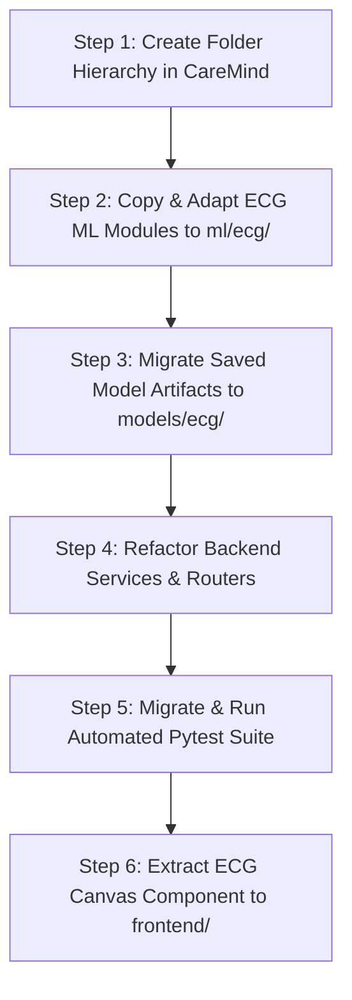

# CareMind ECG Baseline Integration Plan

> **Integration Strategy**: This document provides a step-by-step roadmap for migrating, refactoring, and integrating the standalone `CareMind-ECG` prototype into the main multimodal CareMind repository as its foundational ECG signal processing module.

---

## 1. Existing ECG Prototype Structure

The standalone prototype repository (`prototype`) is organized as follows:

```text
prototype/
├── backend/
│   ├── main.py                       # FastAPI server, WebSockets, CORS, API routes
│   ├── model/model_loader.py         # Singleton SVM & scaler loader
│   ├── schemas/ecg_schema.py         # Pydantic schemas for patients & predictions
│   ├── services/
│   │   ├── ecg_service.py            # High-level ECG processing service
│   │   └── replay_engine.py          # 5-patient simulated stream engine
│   └── utils/
├── frontend/                         # Standalone React + Vite ECG testing UI
│   ├── src/components/
│   │   ├── ECGCanvas.jsx             # Real-time HTML5 Canvas waveform renderer
│   │   ├── Header.jsx                # Navigation & replay controls
│   │   ├── PatientList.jsx           # Multi-patient monitoring sidebar
│   │   └── PredictionCard.jsx        # Model output & alert level card
├── models/ecg/caremind_ecg_model/
│   ├── baseline_scaler.joblib        # Trained StandardScaler
│   ├── baseline_svm.joblib           # Trained Support Vector Machine model
│   ├── config.json                   # Model metadata & class mapping configuration
│   ├── baseline_logistic_regression.joblib
│   ├── baseline_random_forest.joblib
│   ├── ecg_1dcnn_model.pt            # Trained 1D CNN PyTorch weights
│   └── ecg_1dresnet_model.pt         # Trained 1D ResNet PyTorch weights
├── notebooks/                        # Research Jupyter notebooks (01 to 06)
├── src/                              # Core ECG signal processing scripts
│   ├── baseline_models.py            # Scikit-learn model builders
│   ├── cnn_model.py                  # PyTorch 1D CNN / ResNet models
│   ├── dataset_loader.py             # PhysioNet WFDB loader & DS1/DS2 split
│   ├── evaluate.py                   # Evaluation metrics & confusion matrix
│   ├── explainability.py             # Gradient saliency maps
│   ├── feature_extraction.py         # 11D tabular feature extractor
│   ├── preprocessing.py              # Butterworth bandpass filter
│   ├── segmentation.py               # R-peak windowing & AAMI mapping
│   ├── train_and_evaluate.py         # Research execution pipeline
│   └── uncertainty.py                # Monte Carlo Dropout uncertainty
└── tests/
    ├── test_backend_api.py           # Pytest suite for FastAPI backend (7 tests)
    └── test_ecg_pipeline.py          # Pipeline unit tests
```

---

## 2. Existing ECG Capabilities Summary

1. **Signal Preprocessing**: 0.5–40 Hz 2nd-order zero-phase Butterworth filter removing noise and baseline wander.
2. **Segmentation & Labelling**: 250-sample R-peak centered windowing; 5-class AAMI mapping (`N`, `S`, `V`, `F`, `Q`).
3. **Tabular Feature Extraction**: 11-dimensional feature vector ($RR_{prev}$, $RR_{next}$, $RR_{ratio}$, statistical waveform moments).
4. **Production Model Inference**: Trained SVM baseline model (`baseline_svm.joblib` + `baseline_scaler.joblib`) producing calibrated class probabilities.
5. **Deep Learning Architectures**: 1D CNN and 1D ResNet PyTorch models evaluated on raw 250-sample beat windows.
6. **Explainability & Uncertainty**: Gradient-based saliency mapping and MC Dropout epistemic uncertainty quantification.
7. **Replay Simulation**: 5-patient asynchronous stream replay engine over WebSockets.
8. **Automated Testing**: 7 backend API tests and unit tests verifying end-to-end processing.

---

## 3. Categorization of Prototype Components

To avoid blindly copying code, components are categorized into **Reuse**, **Refactor**, or **Prototype-Specific**.

| Component Path | Action | Rationale | Proposed Destination in CareMind |
| :--- | :---: | :--- | :--- |
| `src/preprocessing.py` | **Reuse** | Core signal processing logic; clean and modular. | `ml/ecg/preprocessing.py` |
| `src/segmentation.py` | **Reuse** | R-peak windowing & AAMI mapping definitions. | `ml/ecg/segmentation.py` |
| `src/feature_extraction.py` | **Reuse** | 11D tabular feature vector calculation. | `ml/ecg/feature_extraction.py` |
| `src/cnn_model.py` | **Reuse** | PyTorch 1D CNN & ResNet network architectures. | `ml/ecg/models.py` |
| `src/explainability.py` | **Reuse** | Saliency map generation for 1D signals. | `ml/ecg/explainability.py` |
| `src/uncertainty.py` | **Reuse** | Monte Carlo Dropout uncertainty calculator. | `ml/ecg/uncertainty.py` |
| `models/ecg/caremind_ecg_model/*` | **Reuse** | Trained `.joblib` and `.pt` model artifacts. | `models/ecg/caremind_ecg_model/` |
| `src/dataset_loader.py` | **Refactor** | Adapt WFDB loader paths to CareMind modular structure. | `ml/ecg/dataset_loader.py` |
| `backend/model/model_loader.py` | **Refactor** | Generalize loader to handle multi-vital model artifacts. | `backend/services/model_loader.py` |
| `backend/schemas/ecg_schema.py` | **Refactor** | Integrate into unified Pydantic schemas. | `backend/schemas/ecg.py` |
| `backend/services/replay_engine.py` | **Refactor** | Generalize single-signal replay to multi-vital streaming. | `backend/services/replay_engine.py` |
| `backend/main.py` | **Refactor** | Merge ECG routes into CareMind FastAPI routers. | `backend/main.py` & `backend/routers/` |
| `frontend/src/components/*` | **Refactor** | Extract `ECGCanvas.jsx` component for use in main React app. | `frontend/src/components/ecg/` |
| `src/train_and_evaluate.py` | **Prototype Only** | Standalone research script; keep in prototype repo. | *Do not copy* |
| `frontend/vite.config.js` | **Prototype Only** | Standalone UI config; main frontend will have unified config. | *Do not copy* |

---

## 4. Proposed Target Folder Structure in CareMind

When implementation begins in Phase 2, the main CareMind codebase will adopt the following modular structure:

```text
CareMind/
├── backend/                          # FastAPI microservice
│   ├── main.py                       # App entry point, CORS, WebSockets
│   ├── routers/                      # Modality and system API routers
│   │   ├── ecg_router.py
│   │   ├── patients_router.py
│   │   └── replay_router.py
│   ├── schemas/                      # Pydantic data schemas
│   │   ├── ecg.py
│   │   └── patient.py
│   └── services/                     # Business & ML execution services
│       ├── ecg_service.py
│       ├── model_loader.py
│       └── replay_engine.py
├── ml/                               # Machine Learning Core
│   ├── ecg/                          # ECG Modality Package
│   │   ├── __init__.py
│   │   ├── dataset_loader.py
│   │   ├── explainability.py
│   │   ├── feature_extraction.py
│   │   ├── models.py
│   │   ├── preprocessing.py
│   │   ├── segmentation.py
│   │   └── uncertainty.py
│   ├── bp/                           # Blood Pressure Package (Future)
│   ├── spo2/                         # SpO2 Package (Future)
│   ├── respiratory_rate/             # Resp Rate Package (Future)
│   └── temperature/                  # Temperature Package (Future)
├── models/                           # Model Artifacts Directory
│   └── ecg/
│       └── caremind_ecg_model/
│           ├── baseline_scaler.joblib
│           ├── baseline_svm.joblib
│           ├── config.json
│           ├── ecg_1dcnn_model.pt
│           └── ecg_1dresnet_model.pt
├── data/                             # Dataset Storage Directory (.gitignore)
├── notebooks/                        # Research Jupyter Notebooks
├── tests/                            # Automated Pytest Suite
│   ├── test_ecg_pipeline.py
│   └── test_backend_api.py
├── docs/                             # Project Documentation
└── frontend/                         # Unified React Web Application
```

---

## 5. Model Artifact & Dataset Handling

### Model Artifact Handling
- The trained SVM model (`baseline_svm.joblib`), scaler (`baseline_scaler.joblib`), configuration (`config.json`), and neural weights (`ecg_1dcnn_model.pt`, `ecg_1dresnet_model.pt`) will be copied directly to `models/ecg/caremind_ecg_model/`.
- Large model binaries will be tracked using Git LFS or stored in external storage if file size constraints require.

### Dataset Handling
- Raw PhysioNet MIT-BIH dataset records will reside in `data/mitdb/` (excluded from Git tracking via `.gitignore`).
- Modular data loader `ml/ecg/dataset_loader.py` will read from `data/mitdb/` using configurable relative paths.

---

## 6. FastAPI & Router Integration

In the prototype, all endpoints resided in a single `backend/main.py` file. In main CareMind, FastAPI APIRouters will be introduced:

- `backend/routers/ecg_router.py`: Handles `/api/ecg/predict`, `/api/ecg/features`, and `/api/ecg/saliency`.
- `backend/routers/replay_router.py`: Handles `/api/replay/start`, `/api/replay/stop`, `/api/replay/speed`.
- `backend/main.py`: Includes all routers and exposes the multi-patient WebSocket endpoint (`/ws/patients`).

---

## 7. Testing Strategy for Integration

1. **Pipeline Verification**: Re-run unit tests (`tests/test_ecg_pipeline.py`) post-migration to confirm that filtering, 11D feature extraction, and SVM predictions match prototype outputs exactly.
2. **API Endpoint Verification**: Adapt `tests/test_backend_api.py` to test the new FastAPI router paths.
3. **Regression Check**: Verify that prediction outputs for benchmark MIT-BIH test records yield identical class probabilities before and after integration.

---

## 8. Migration Risks & Mitigation

| Migration Risk | Severity | Potential Impact | Mitigation Strategy |
| :--- | :---: | :--- | :--- |
| **Path Inconsistency** | Low | Broken file imports or model loading failures. | Use `pathlib.Path` relative to project root in `model_loader.py`. |
| **Dependency Version Mismatches** | Medium | Incompatible `scikit-learn` or `torch` versions. | Pin exact package versions in `requirements.txt`. |
| **WebSocket Port / Route Conflicts** | Low | Frontend connection failures. | Standardize backend WebSocket URL schema in environment config. |
| **Namespace Collisions** | Low | Module import ambiguity. | Use explicit package imports (`from ml.ecg.preprocessing import ...`). |

---

## 9. Step-by-Step Integration Sequence



1. **Step 1**: Create directory structure (`ml/ecg/`, `models/ecg/`, `backend/routers/`, `backend/schemas/`, `backend/services/`).
2. **Step 2**: Copy core ECG processing modules (`preprocessing.py`, `segmentation.py`, `feature_extraction.py`, `cnn_model.py`, `explainability.py`, `uncertainty.py`) to `ml/ecg/`.
3. **Step 3**: Copy trained model artifacts to `models/ecg/caremind_ecg_model/`.
4. **Step 4**: Implement `backend/services/model_loader.py` and `backend/routers/ecg_router.py`.
5. **Step 5**: Migrate Pytest suite to `tests/` and execute empirical verification tests.
6. **Step 6**: Port `ECGCanvas.jsx` to `frontend/src/components/ecg/` for UI rendering.
