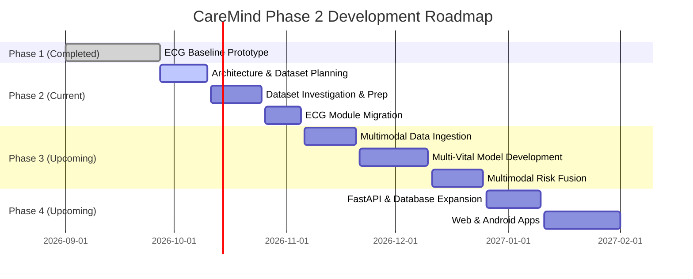

# CareMind Project Design

> **Clinical Disclaimer**: CareMind is an academic research project and a clinical decision-support system prototype. Predictions, alert scores, and risk prioritization outputs generated by CareMind are intended solely to assist healthcare professionals by highlighting potential risk patterns. CareMind is strictly a decision-support system and is **NOT** a substitute for clinical judgment, medical diagnosis, direct patient evaluation, or primary monitoring equipment.

---

## 1. Project Overview

**CareMind** is an AI-driven multimodal Intensive Care Unit (ICU) clinical decision-support system designed for early patient risk prediction, continuous physiological signal monitoring, and automated multi-patient prioritization. 

In modern critical care environments, clinicians are bombarded with continuous high-density data streams from diverse telemetry monitors, laboratory tests, and clinical bedside devices. This high volume of heterogeneous data often leads to alarm fatigue, delayed response to subtle physiological deterioration, and cognitive overload. CareMind addresses this challenge by ingesting physiological telemetry and clinical signals, extracting meaningful representations, fusing multimodal temporal patterns, and presenting actionable risk scores with explainability and uncertainty estimates to attending ICU staff.

---

## 2. Problem Statement

1. **Alarm Fatigue & Noise Overhead**: ICU monitors trigger frequent false or non-actionable alarms, causing alarm fatigue and desensitization among clinical staff.
2. **Fragmented Modality Monitoring**: Existing monitoring systems typically monitor physiological parameters (ECG, blood pressure, SpO2, respiratory rate, body temperature) in isolated silos without holistic multi-signal risk fusion.
3. **Delayed Risk Detection**: Early signs of critical conditions such as sepsis, hemodynamic instability, or cardiac decompensation are often subtle and distributed across multiple vitals before overt clinical collapse occurs.
4. **Lack of Explainability & Confidence Metrics**: Black-box AI models in critical care lack transparency, preventing clinicians from trusting predictions unless accompanied by feature attribution and model uncertainty estimates.
5. **Static Patient Prioritization**: Traditional ICU dashboards list patients statically rather than dynamically sorting patient queues based on real-time physiological risk trajectories.

---

## 3. Project Goal

The goal of CareMind is to develop, evaluate, and demonstrate an end-to-end multimodal clinical decision-support platform that:
- Seamlessly integrates single-signal analysis modules (starting with a pre-validated ECG baseline foundation) into a unified multimodal architecture.
- Predicts early patient deterioration and acute clinical risk trajectories.
- Evaluates feature-level explainability (saliency / attribution) and prediction uncertainty (Monte Carlo Dropout / confidence scores).
- Dynamic patient prioritization across an ICU ward using real-time streaming replay simulations.
- Delivers real-time insights via an intuitive web dashboard and mobile interface.

---

## 4. Clinical Decision-Support Scope

CareMind is explicitly designed as a **Clinical Decision-Support System (CDSS)**.

```
┌────────────────────────────────────────────────────────────────────────┐
│                        CareMind CDSS Architecture                      │
│                                                                        │
│   Physiological Telemetry ──► Feature Processing ──► Risk Prediction   │
│                                                            │           │
│                                                            ▼           │
│   Human-in-the-Loop Clinical Verification ◄── Alert & Explainability   │
└────────────────────────────────────────────────────────────────────────┘
```

- **Decision Support, Not Replacement**: CareMind does not make independent medical decisions or issue automated treatment commands. It synthesizes complex signals to alert clinicians to abnormal patterns.
- **Human-in-the-Loop**: All risk scores, alert statuses, and diagnostic predictions require clinician verification.
- **Triage & Prioritization**: The primary operational value lies in directing clinician attention to patients showing early signals of instability.

---

## 5. Core Objectives

1. **Baseline Modular Integration**: Incorporate the completed standalone ECG prototype as the baseline single-signal module.
2. **Multimodal Data Strategy**: Investigate and select appropriate ICU datasets (e.g., MIMIC-IV, MIMIC-IV Waveform, PhysioNet 2019, VitalDB) to expand beyond ECG to Blood Pressure (BP), Oxygen Saturation (SpO2), Respiratory Rate (RR), and Temperature.
3. **Multimodal Fusion**: Develop fusion strategies (early, late, or hybrid temporal fusion) to combine heterogeneous time-series and tabular vital data.
4. **Explainability & Uncertainty Quantification**: Provide clinical transparency via feature importance/saliency maps and uncertainty metrics.
5. **Real-time Replay Simulation**: Extend single-patient and multi-patient replay engines to simulate multi-vital ICU telemetry streaming.
6. **Cross-Platform Access**: Deliver real-time alerts and risk dashboards via a React web application and an Android mobile application backed by a FastAPI microservice and Supabase/PostgreSQL database.

---

## 6. Current Completed Work (ECG Baseline Foundation)

A standalone, fully validated ECG prototype (`CareMind-ECG`) has been completed and serves as the baseline foundation for CareMind.

| Component | Status | Implementation Details |
| :--- | :---: | :--- |
| **MIT-BIH Arrhythmia Database** | **Completed** | Processed 48 records (360 Hz) with de Chazal et al. (2004) DS1/DS2 inter-patient train/test split (51,002 train beats, 49,692 test beats). Excluded 4 paced records per AAMI standards. |
| **ECG Signal Preprocessing** | **Completed** | 2nd-order zero-phase Butterworth bandpass filter (0.5 – 40 Hz) eliminating baseline wander, muscle artifacts, and powerline noise. |
| **Beat Segmentation & Labelling** | **Completed** | 250-sample window centered at R-peak (90 samples pre-R, 160 samples post-R). Mapped beat annotations to 5 standard AAMI classes (`N`, `S`, `V`, `F`, `Q`). |
| **Tabular Feature Extraction** | **Completed** | 11-dimensional feature vector per beat (mean, std, max, min, peak-to-peak, RMS, skewness, kurtosis, $RR_{prev}$, $RR_{next}$, $RR_{ratio}$). |
| **Baseline ML Models** | **Completed** | Trained and evaluated Logistic Regression, Random Forest, and Support Vector Machine (SVM) models using scikit-learn. |
| **SVM Inference Pipeline** | **Completed** | Production baseline using `StandardScaler` + `SVC.predict_proba()` saved in `models/ecg/caremind_ecg_model/` (`baseline_svm.joblib`, `baseline_scaler.joblib`, `config.json`). Achieved 86.85% accuracy / 0.4357 Macro F1 on unseen DS2 test set. |
| **1D CNN / ResNet Experiments** | **Completed** | PyTorch 1D CNN and 1D ResNet architectures evaluated on raw 250-sample beat windows. |
| **Explainability & Uncertainty** | **Completed** | Gradient-based saliency mapping (`src/explainability.py`) and Monte Carlo Dropout uncertainty estimation (`src/uncertainty.py`). |
| **FastAPI Backend** | **Completed** | Async FastAPI service featuring REST endpoints (`/api/health`, `/api/patients`, `/api/predict`, `/api/replay/*`) and WebSocket streaming (`ws://.../ws/patients`). |
| **Replay Engine** | **Completed** | 5-patient simulated real-time stream replay engine (`P01`–`P05`) replaying MIT-BIH records with configurable playback speed (1.0x, 2.0x, 5.0x). |
| **React Visual Dashboard** | **Completed** | React + Vite dashboard featuring HTML5 Canvas waveform rendering, multi-patient sidebar, live alert indicators, and ML prediction cards. |
| **Automated Test Suite** | **Completed** | Automated pytest suite (`tests/test_backend_api.py`, `tests/test_ecg_pipeline.py`) validating model loading, prediction output structure, API responses, and replay engine logic. |

---

## 7. Overall Development Roadmap



---

## 8. Research Question

> **Primary Research Question**: *Can late or hybrid fusion of physiological waveform representations (ECG) with synchronized continuous vital sign dynamics (BP, SpO2, Respiratory Rate, Temperature) significantly improve early ICU risk prediction accuracy and reduce false alarm rates compared to single-modality baseline models, while providing clinically interpretable saliency and reliable uncertainty bounds?*

---

## 9. Proposed Experimental Strategy

1. **Single-Modality Baselines**: Evaluate signal-specific baseline models for each available vital sign parameter independently.
2. **Feature Extraction vs End-to-End Deep Learning**: Compare handcrafted statistical/temporal features (e.g., 11D ECG features, BP variability stats) against 1D CNN / Transformer feature extraction from raw physiological time-series.
3. **Fusion Architecture Benchmarking**:
   - **Early Fusion**: Concatenating raw or preprocessed signal vectors prior to model input.
   - **Late Fusion**: Combining softmax class probability outputs from independent single-signal classifiers using weighted averaging or stacking.
   - **Hybrid Temporal Fusion**: Utilizing recurrent/attention-based networks (LSTM, GRU, Transformer) to fuse intermediate embeddings across time steps.
4. **Evaluation Metrics**: Evaluate performance using Macro F1, Area Under Precision-Recall Curve (AUPRC), Sensitivity (Recall), Specificity, and Alarm Reduction Percentage on unseen test splits.

---

## 10. Explainability and Uncertainty

To ensure clinical trust and adoption, CareMind incorporates explainability and uncertainty quantification directly into the prediction pipeline:

- **Feature-Level & Signal Saliency**:
  - For tabular features: SHAP (SHapley Additive exPlanations) values indicating feature contributions to risk scores.
  - For waveform signals: Gradient-based saliency mapping highlights specific signal sub-segments (e.g., ST-segment elevation, abnormal T-waves) triggering risk alerts.
- **Model Uncertainty Quantification**:
  - **Monte Carlo Dropout (MC Dropout)**: Performing multiple stochastic forward passes at inference time to compute epistemic uncertainty (model confidence variance).
  - **Probability Calibration**: Softmax probabilities calibrated using temperature scaling to represent true likelihoods.

---

## 11. Multi-patient ICU Prioritization

ICU wards require dynamic patient triage rather than isolated individual patient monitoring.

- **Risk Score Calculation**: Each patient record produces a normalized Risk Score $S_i \in [0, 100]$ computed from combined multimodal predictions and confidence metrics.
- **Priority Queue Engine**: Patients are automatically categorized into status levels:
  - **Critical** ($S_i \ge 75$): Red indicator, high-frequency alert, top queue ranking.
  - **Warning** ($50 \le S_i < 75$): Yellow indicator, moderate queue ranking.
  - **Normal** ($S_i < 50$): Green indicator, routine monitoring status.
- **Dynamic Sorting**: The backend priority queue continuously re-sorts patient lists so clinicians immediately see the most hemodynamically unstable patients at the top of the interface.

---

## 12. Real-time Replay Simulation

Because accessing live hospital telemetry feeds during academic research is impractical, CareMind uses a multi-patient real-time replay simulation architecture:

- **Asynchronous Telemetry Streamer**: Reads pre-recorded physiological time-series datasets and streams data points over WebSockets at configurable sample rates and playback multipliers (1.0x real-time up to 5.0x fast-forward).
- **Simulated Multi-Bed Ward**: Replays up to 10 simulated ICU beds simultaneously to evaluate multi-patient prioritization and WebSocket broadcast performance.

---

## 13. Web and Android Application Plan

CareMind delivers decision-support insights across two user interfaces:

- **React Web Dashboard**:
  - Designed for ICU central station display monitors.
  - High-performance HTML5 Canvas wave rendering for multi-lead waveforms.
  - Live patient priority grid, risk score trends, detail modal, and SHAP/saliency explainability panels.
- **Android Mobile Application**:
  - Designed for attending physicians and nurses on ward rounds.
  - Lightweight mobile interface receiving push notifications for **Critical** patient alerts.
  - Quick view of patient vitals, active risk scores, and recent trend charts.

---

## 14. Limitations and Clinical Disclaimer

### Limitations
1. **Retrospective Data Artifacts**: Models trained on retrospective public databases (MIT-BIH, MIMIC-IV) may experience domain shift when evaluated on live telemetry streams.
2. **Signal Artifact Sensitivity**: Motion artifacts, electrode detachment, and sensor disconnects in real-world ICU environments require robust noise detection filters prior to inference.
3. **Cross-Dataset Signal Alignment**: Combining physiological datasets from different patient cohorts poses alignment and missingness challenges.

### Mandatory Clinical Disclaimer
 CareMind is an academic research software prototype designed strictly for clinical decision-support research. It is **NOT** a certified medical device, does **NOT** provide automated diagnosis or treatment recommendations, and must **NEVER** replace clinical judgment or primary medical telemetry monitoring systems. All outputs must be verified by qualified medical professionals.
